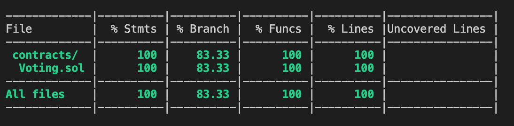

# Advanced Sample Hardhat Project


```shell
npx hardhat add-voting
npx hardhat accounts
npx hardhat compile
npx hardhat clean
npx hardhat test
npx hardhat node
npx hardhat help
REPORT_GAS=true npx hardhat test
npx hardhat coverage
npx hardhat run scripts/deploy.js
node scripts/deploy.js
npx eslint '**/*.js'
npx eslint '**/*.js' --fix
npx prettier '**/*.{json,sol,md}' --check
npx prettier '**/*.{json,sol,md}' --write
npx solhint 'contracts/**/*.sol'
npx solhint 'contracts/**/*.sol' --fix
```

# Etherscan verification

I deployed contract into Rinkeby test network

I checked all the contract functionality in rinkeby etherscan after deploying my contract

I wrote all the tests, and checked it with solidity-coverage
Here is the result from solidity coverage



I sent it untill 00:00 by Almaty Time